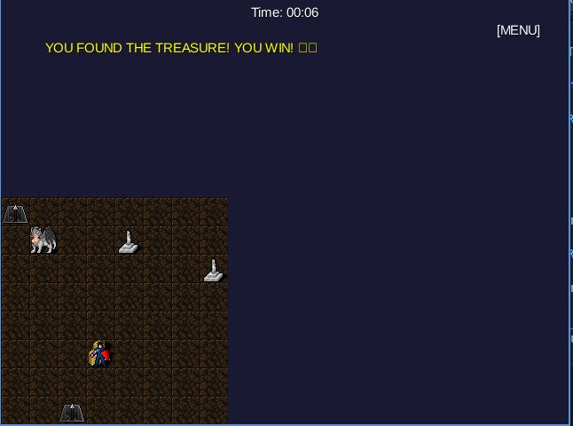

# wumpus-game

A [libGDX](https://libgdx.com/) project generated with [gdx-liftoff](https://github.com/libgdx/gdx-liftoff).

This project was generated with a template including simple application launchers and an `ApplicationAdapter` extension that draws libGDX logo.

---

## Game Development Summary: Q-Learning Bot

This project was extended from a basic Wumpus-like cave game into an environment for **Reinforcement Learning (RL)**, specifically using the **Q-Learning** algorithm.

### Key Features Implemented:

* **Wumpus Environment:** An 8x8 grid world featuring a **Player**, **Wumpus**, **Traps**, **Treasure**, and **Obstacles**.
* **Game Modes:** Supports both **Single Player** (human-controlled with Fog of War) and **Bot Player (Training)** modes.
* **Q-Learning Agent:** The bot uses an Epsilon-Greedy strategy to explore and exploit the environment. It leverages **rewards** based on movement (`-1.0`), hitting obstacles/walls (medium penalty), and terminal states (**Win** `+100.0`, **Loss** `-100.0`).
* **Fixed Grid Training:** Critically, the bot's training is conducted on a **single, unchanging grid layout**. When the bot loses an episode (hits a trap or the Wumpus), the environment resets the bot's position, game state (lance, Wumpus status), and episode counter, but **retains the exact positions of the Wumpus, Traps, Treasure, and Obstacles**. This ensures the Q-Table learns the optimal path for that specific map configuration.

---

## Screenshots

An example of the game environment and the bot's interaction:

---

## Platforms

- `core`: Main module with the application logic shared by all platforms.
- `lwjgl3`: Primary desktop platform using LWJGL3; was called 'desktop' in older docs.
- `android`: Android mobile platform. Needs Android SDK.

## Gradle

This project uses [Gradle](https://gradle.org/) to manage dependencies.
The Gradle wrapper was included, so you can run Gradle tasks using `gradlew.bat` or `./gradlew` commands.
Useful Gradle tasks and flags:

- `--continue`: when using this flag, errors will not stop the tasks from running.
- `--daemon`: thanks to this flag, Gradle daemon will be used to run chosen tasks.
- `--offline`: when using this flag, cached dependency archives will be used.
- `--refresh-dependencies`: this flag forces validation of all dependencies. Useful for snapshot versions.
- `android:lint`: performs Android project validation.
- `build`: builds sources and archives of every project.
- `cleanEclipse`: removes Eclipse project data.
- `cleanIdea`: removes IntelliJ project data.
- `clean`: removes `build` folders, which store compiled classes and built archives.
- `eclipse`: generates Eclipse project data.
- `idea`: generates IntelliJ project data.
- `lwjgl3:jar`: builds application's runnable jar, which can be found at `lwjgl3/build/libs`.
- `lwjgl3:run`: starts the application.
- `test`: runs unit tests (if any).

Note that most tasks that are not specific to a single project can be run with `name:` prefix, where the `name` should be replaced with the ID of a specific project.
For example, `core:clean` removes `build` folder only from the `core` project.